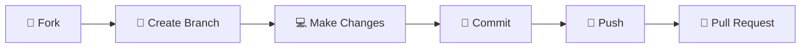

<div align="center">

<!-- Waving Header Banner -->


### _Interactive JavaScript Projects for Learning and Practice_


---

### 💫 A curated collection of mini JavaScript projects showcasing various web development concepts and interactive features

</div>

---

## 📋 Projects

<table>
<tr>
<td width="50%">

### 🎂 Age Calculator

A simple and interactive age calculator that computes your exact age in years, months, and days based on your date of birth.

**✨ Features:**

- 🎨 Clean and responsive UI
- ✅ Date validation
- ⚡ Real-time age calculation
- 📊 Displays age in years, months, and days

**🔧 Technologies Used:**

- HTML5
- CSS3
- JavaScript (ES6+)

</td>
<td width="50%">

### 🔜 Coming Soon...

More exciting projects are on the way!

Stay tuned for:

- 🌤️ Weather App
- ✅ To-Do List
- 🧠 Quiz Application
- 🧮 Calculator
- ⏰ Digital Clock

</td>
</tr>
</table>

---

## 🛠️ Installation & Usage

```bash
# 1️⃣ Clone the repository
git clone https://github.com/nikhilxagr/JS-Mini-Project.git

# 2️⃣ Navigate to the project directory
cd JS-Mini-Project

# 3️⃣ Open any project folder
cd "Age Calculator"

# 4️⃣ Open index.html in your preferred browser
```

---

## 📂 Project Structure

```
JS-Mini-Project/
│
├── 📁 Age Calculator/
│   ├── 📄 index.html
│   ├── 🎨 style.css
│   └── ⚡ script.js
│
└── 📖 README.md
```

---

## 🎯 Purpose

<div align="center">

| 🎓 Learning            | 💼 Showcase                  | 🏋️ Practice          | 📚 Reference              |
| ---------------------- | ---------------------------- | -------------------- | ------------------------- |
| Resource for beginners | Mini project implementations | Web dev fundamentals | Common JS functionalities |

</div>

This repository serves as a comprehensive platform for:

- 📖 **Learning**: A resource for JavaScript beginners to understand core concepts
- 🎨 **Showcase**: Practical implementations of various web development features
- 💪 **Practice**: Hands-on exercises for mastering web development fundamentals
- 🔍 **Reference**: Quick reference material for common JavaScript functionalities

---

## 🤝 Contributing

We ❤️ contributions! If you'd like to add more mini projects or improve existing ones:

<div align="center">



</div>

1. 🍴 Fork the repository
2. 🌿 Create a new branch (`git checkout -b feature/new-project`)
3. 💻 Commit your changes (`git commit -m 'Add new project'`)
4. 🚀 Push to the branch (`git push origin feature/new-project`)
5. 🔄 Open a Pull Request

---

## 🚀 Future Projects

<div align="center">

### 🎨 Exciting projects coming soon!

| Project             | Status     | Description                   |
| ------------------- | ---------- | ----------------------------- |
| 🌤️ Weather App      | 📋 Planned | Real-time weather information |
| ✅ To-Do List       | 📋 Planned | Task management app           |
| 🧠 Quiz Application | 📋 Planned | Interactive quiz game         |
| 🧮 Calculator       | 📋 Planned | Scientific calculator         |
| ⏰ Digital Clock    | 📋 Planned | Real-time digital clock       |
| 🎮 And many more... | 📋 Planned | Stay tuned!                   |

</div>

---

## 👨‍💻 Author

<div align="center">

### **Nikhil Agrahari**

[](https://github.com/nikhilxagr)
[](https://github.com/nikhilxagr)

_"Code. Learn. Repeat."_ 🚀

</div>

---

## 📜 License

<div align="center">

This project is open source and available under the **MIT License**.

```
MIT License - feel free to use, modify, and distribute!
```

</div>

---

## ⭐ Show Your Support

<div align="center">

### If you find these projects helpful, please consider giving this repository a star! ⭐


---

### 💬 Get in Touch

Have questions or suggestions? Feel free to open an issue or reach out!

[](https://github.com/nikhilxagr/JS-Mini-Project/issues)
[](https://github.com/nikhilxagr/JS-Mini-Project/pulls)

</div>

---

<div align="center">

### 🎉 Happy Coding! 🎉

_Made with ❤️ and ☕ by Nikhil Agrahari_

**✨ Explore • 📚 Learn • 🚀 Build ✨**

</div>
